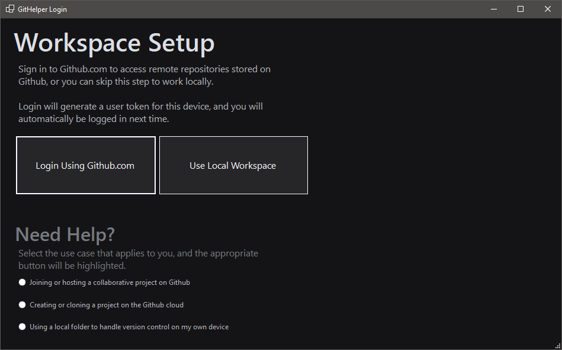
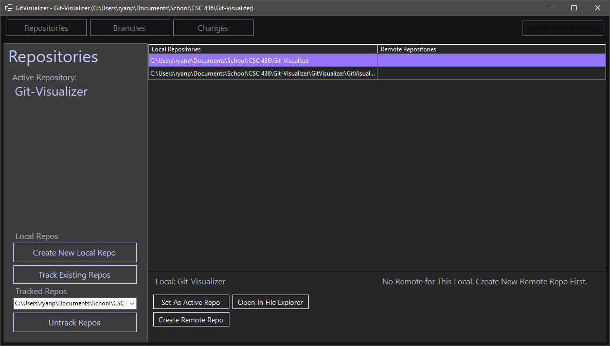
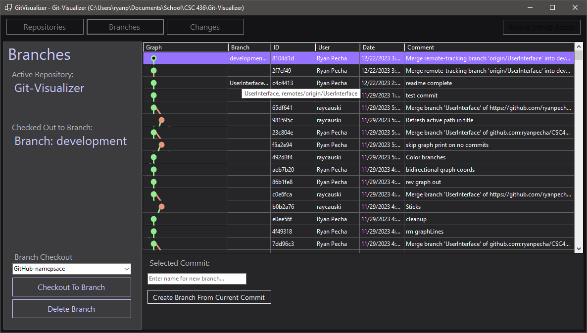
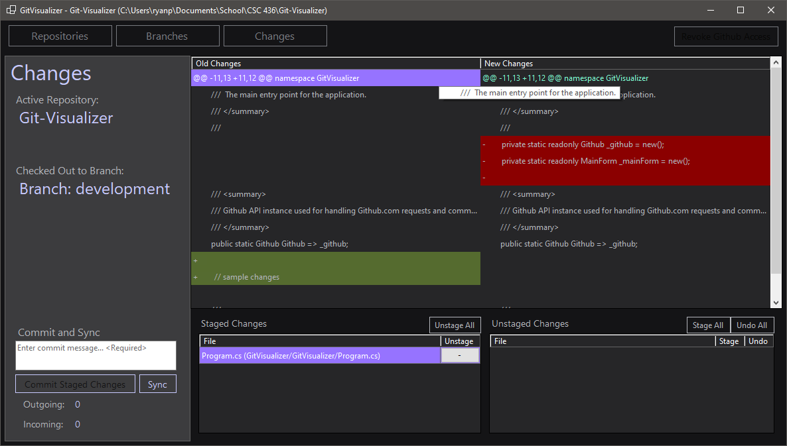

# Git Visualizer

## Developers

* Kyle Walker
* Ryan Pecha
* Patrick Comden
* Nam Do

## User Dependencies

* [Git](https://git-scm.com/book/en/v2/Getting-Started-Installing-Git)
* Windows 10 or newer

## Dev Setup

1. Run `git clone https://github.com/ryanpecha/Git-Visualizer.git`
2. Install [Visual Studio](https://visualstudio.microsoft.com/downloads/) >= 2017
3. Install [.NET Framework 4.8 (Developer Pack)](https://dotnet.microsoft.com/en-us/download/visual-studio-sdks?cid=getdotnetsdk)
4. Install [Git](https://git-scm.com/book/en/v2/Getting-Started-Installing-Git) >= TBD

## Examples

### Setup

### Repositories

### Branches

### Changes

